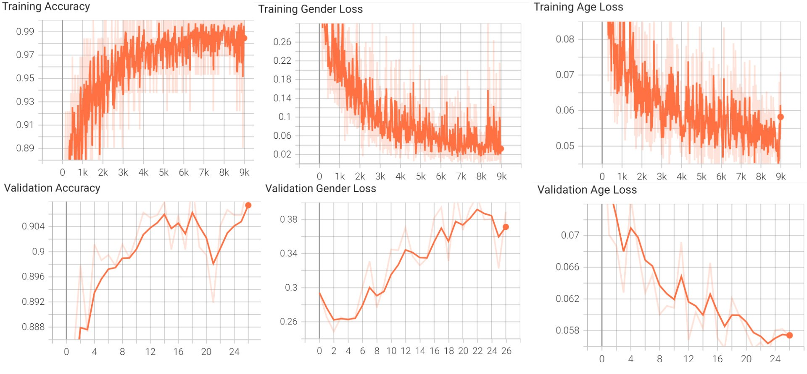

## Pytorch: Gender and Age Recognition

A model of **image classification** based on **Efficient Net B0** architecture using pytorch. Here, i use a **custom dataset** about gender and age of people .

### Workflow
**1.** Build **multi-tasks** model

**2.** Clone raw dataset

**3.** Fix dataset

**4.** Train model and repeat with difference hyperparameters

### Dependencies

* Numpy
* Python3
* Pytorch

```python
pip instal numpy         # numpy library
pip instal pytorch       # pytorch library
pip install torchsummary # summary
pip install torchvision  # pytorch for vision
```

**NB**: Update the libraries to their latest versions before training.

### How to run
----------------------------------------
⬇️⬇️**Download** and extract training dataset on Kaggle: [Gender and Age Dataset](https://www.kaggle.com/datasets/vanduc0xff/gender-and-age-dataset)

⬇️⬇️**Download** pretrained model: [Model](https://drive.google.com/drive/folders/1_M6rplng9CWNEFLZeA_6dvohKGBTnEc_?usp=sharing)


Run the following **scripts** for training and/or testing

```python
python train.py # For training the model 
```
------------------------------------------

### Training results

|              | Accuracy of gender | L1 Loss of Age | Training Epochs | Training Mode | Size |
|--------------|--------------------|----------------|-----------------|-----|------|
| **Training** | 98.97%             | 0.052          | 22              |  scratch | 35MB |
| **Testing**  | 92.37%             | 0.057          | 22              |  scratch | 35MB |

**Batch size**: 64, **GPU**: RTX 3050 4G

### Training graphs

**Model:** 

Finetuning the model.


### Observations

1. The **MODEL** based on Efficient Net so have 5M params has a small size i.e **35 MB**.
2. Adjusting parameters like **batch size, number of workers, pin_memory, ** etc. may help you **reduce training time**, especially if you have a big dataset and a high-end machine(hardware).
3. Adjusting parameters like **learning rate, weight decay** etc maybe can help you **improve** model.
### Todo

1. Experiments with different **learning-rate and optimizers**.
2. **Converting and optimizing** pytorch models for **mobile** deployment.

### Authors

Van Duc
 
### Acknowledgments
* "https://arxiv.org/pdf/1905.11946.pdf"